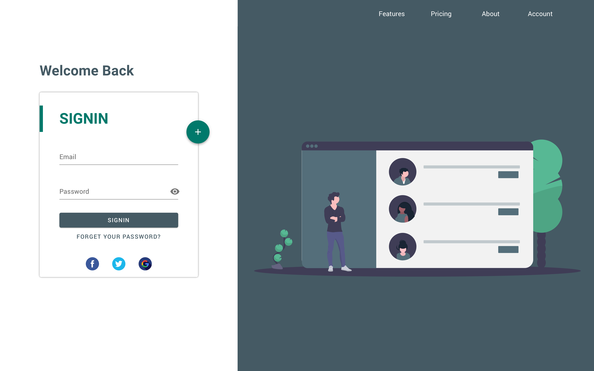

# RoloBox

- [rolobox-angular]()
- [rolobox-node]()
- [rolobox-flutter]()

## intro
RoloBox is an application that allows users to manage a list of contacts while supporting a photo-based matching feature so that users can upload images of their contacts and, more importantly, identify those contacts at a later time by taking a photo of a room or gathering with their phone. Once a person is labeled with contact information in a photo, they will later be recognized and automatically labeled when appearing in another photo.

## design
- login page

see more in [design](design)
