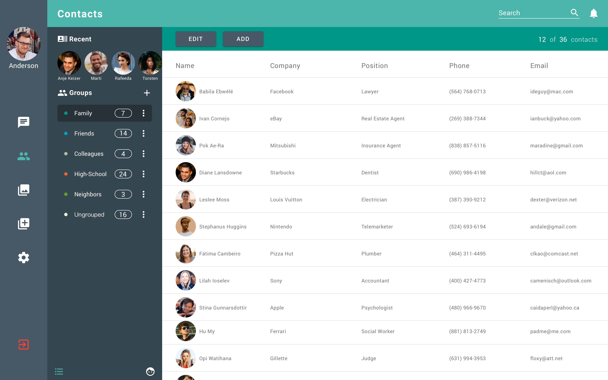

# RoloBox
RoloBox is my capstone project during my study in [UWL](https://www.uwlax.edu/), it has been moved offline after I completed my project presentation. If you would like to see the demo, go to [Bilibili](https://www.bilibili.com/video/bv1q54y1i7nr).

The project has been divided into three parts:
- [rolobox-node](https://github.com/greenlihui/rolobox-node)
- [rolobox-angular](https://github.com/greenlihui/rolobox-angular)
- [rolobox-flutter](https://github.com/greenlihui/rolobox-flutter)

This repository is the web part of RoloBox, written with angular.

More details about rolobox can be found in [rolobox-node](https://github.com/greenlihui/rolobox-node)

## design
- app icon
    - A simple and well designed icon is indispensable for a product to impress their users. Figure \ref{fig:appIcon} shows the application icon of RoloBox, where the outer box is of a camera shape and the screen of the camera display a business card. Through the combination of these two simple object, the icon clearly convey the idea of RoloBox. That is, quickly get a person's contact information by taking a photo.
    - 
- contact list page

see more design work produced with sketch in this folder [design](design)

## folder structure
- [angular folder structure practice](https://medium.com/@motcowley/angular-folder-structure-d1809be95542)
